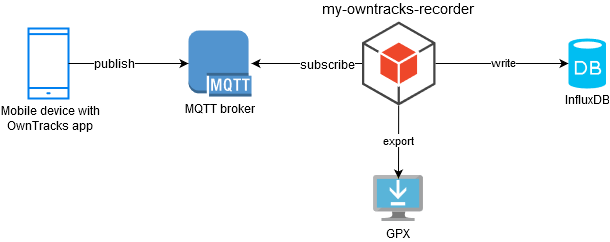
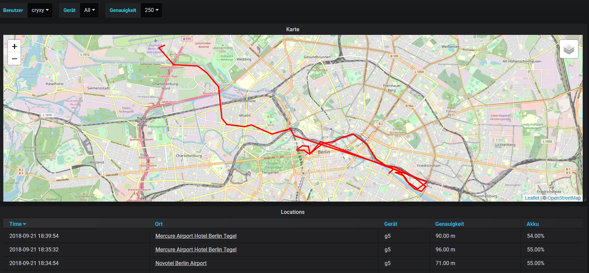

[](https://dev.azure.com/FabianGirgert/my-owntracks-recorder/_build/latest?definitionId=2?branchName=master)
# my-owntracks-recorder
Store and access data published by OwnTracks apps in InfluxDB. It supports offline reverse geocoding, geohashing, and GPX export (REST API). 

## Architecture


## Grafana Integration
Use [grafana-trackmap-panel](https://github.com/pR0Ps/grafana-trackmap-panel) to visualize your GPS points on a map in Grafana. 



Query: `SELECT "lat", "lon" FROM "locations" WHERE ("userName" =~ /^$user$/ AND "deviceName" =~ /^$deviceName$/ AND "accuracy" =~ /^$accuracy$/) AND $timeFilter`

## System requirements
- OwnTracks app (Android / iOS)
- MQTT broker (Mosquitto, ...)
- InfluxDB
- Docker or JRE (>= 1.8)
- Grafana (optional visualization)

## Getting started

### Create InfluxDB Database and Users
```bash
$ influx
Connected to http://localhost:8086 version 0.13
InfluxDB shell version: 0.13
> CREATE DATABASE owntracks_db
> CREATE USER owntracks WITH PASSWORD 'AnotherSuperbPassword456-'
> CREATE USER grafana WITH PASSWORD 'PleaseLetMeRead789?'
> GRANT ALL ON owntracks_db TO owntracks
> GRANT READ ON owntracks_db TO grafana
> exit
```

### Configuration
- create a `config` folder
- download one or more placenames file from http://download.geonames.org/export/dump/ for performing reverse geocoding
- customize the `config.properties`:

```
# MQTT-Server
# Allowed URIs: https://www.eclipse.org/paho/files/javadoc/org/eclipse/paho/client/mqttv3/MqttClient.html#MqttClient-java.lang.String-java.lang.String-
de.cryxy.owntracks.recorder.mqtt.server.uri = ssl://domain.de:8883
de.cryxy.owntracks.recorder.mqtt.server.user.name = 
de.cryxy.owntracks.recorder.mqtt.server.user.password = 
de.cryxy.owntracks.recorder.mqtt.server.topic = owntracks/#

# Geohashing 
# https://gis.stackexchange.com/questions/115280/what-is-the-precision-of-a-geohash
de.cryxy.owntracks.recorder.processing.geohashCharacterPrecision=6
# Geocoding
# http://download.geonames.org/export/dump/
de.cryxy.owntracks.recorder.processing.geonames.zips=config/DE.zip,config/RE.zip
# Only major city names?
de.cryxy.owntracks.recorder.processing.geonames.onlyMajorCities=true

# InfluxDB
de.cryxy.owntracks.recorder.influxdb.url = http://influxdb.my-domain.com:8086
de.cryxy.owntracks.recorder.influxdb.dbName = owntracks_db
de.cryxy.owntracks.recorder.influxdb.user.name = owntracks
de.cryxy.owntracks.recorder.influxdb.user.password = AnotherSuperbPassword456-

# API
de.cryxy.owntracks.recorder.api.user.name = 
de.cryxy.owntracks.recorder.api.user.password = 
```

### Run it with docker as system.d service
It is assumed that your config folder is located under `/opt/owntracksrecorder/config`
 
Place this `owntracksrecorder.service` file into `/etc/systemd/system`.

```
[Unit]
Description=My Owntracks-Recorder
Requires=docker.service
After=docker.service

[Service]
Restart=always
ExecStart=/usr/bin/docker run --name=%n \
  -v /etc/localtime:/etc/localtime:ro \
  -v /etc/timezone:/etc/timezone:ro \
  -v /opt/owntracksrecorder/config:/start/config:ro \
  -p 8080:8080 \
  -e RECORDER_CONFIG=/start/config/config.properties \
  cryxy/my-owntracks-recorder:1.0.0-snapshot
ExecStop=/usr/bin/docker stop -t 2 %n ; /usr/bin/docker rm -f %n

[Install]
WantedBy=multi-user.target
```

Then run `sudo systemctl enable owntracksrecorder.service`.

Finally run `sudo systemctl start owntracksrecorder.service` to start my-owntracks-recorder running.

### Run it without docker
- check out the project
- build the project `mvn clean install`
- cd `my-owntracks-recorder-app`
- start the application from the `target` folder with `java -jar my-owntracks-recorder-app.jar`

## API for GPX Export
The REST-API is secured using Basic-Auth. Use the credentials you provided in the `config.properties`. 
 
```
POST /api/locations/query HTTP/1.1
Host: localhost:8080
Content-Type: application/json
Authorization: Basic xyz=

{"startDate": "2018-11-10T00:00:00", "endDate":"2018-11-24T00:00:00","userName":"cryxy"}
```

More query options are available. See `de.cryxy.owntracks.recorder.influxdb.LocationQuery`.

## Release 
manual: 
- ``mvn versions set`` to release version
- create release on github
- ``mvn versions set`` to new snapshot version
